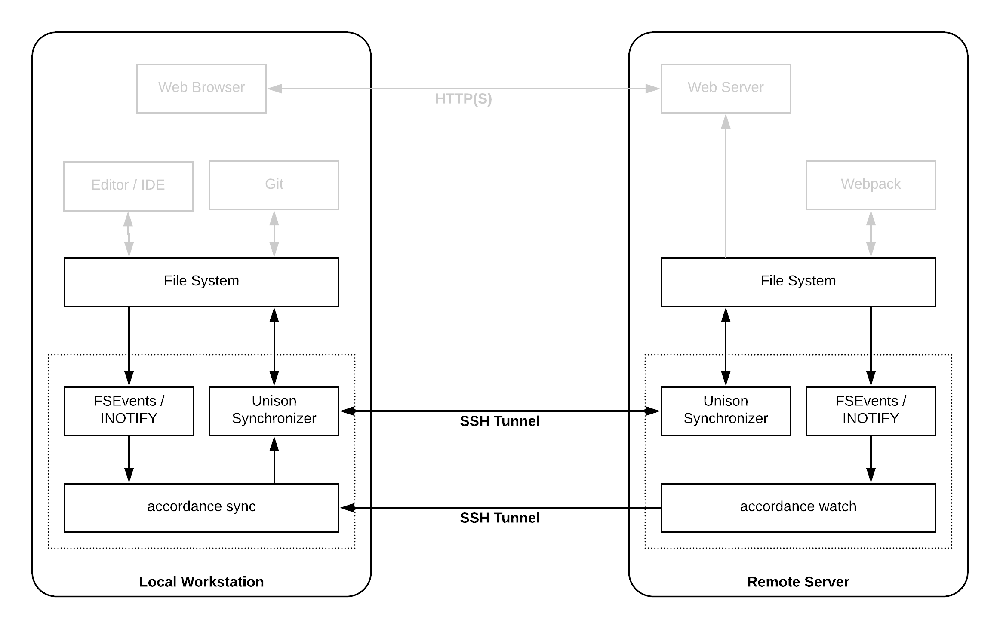

# Accordance

Accordance is a wrapper script around the [Unison file synchronizer](http://www.cis.upenn.edu/~bcpierce/unison/). What's Unison? The Unison documentation says:

> Unison is a file-synchronization tool for OSX, Unix, and Windows. It allows two replicas of a collection of files and directories to be stored on different hosts (or different disks on the same host), modified separately, and then brought up to date by propagating the changes in each replica to the other.

Unison is much like [rsync](https://en.wikipedia.org/wiki/Rsync), except that it sync's files bi-directionally instead of unidirectionally. This makes it ideal for use-cases like synchronizing a VCS (like Git) repository's working copy to a remote server during development.

## Why do I need this?

While traveling, I typically bring a 12" MacBook to save weight. This machine is perfectly capable of running Sublime Text, but it doesn't have nearly enough RAM or CPU power to run my full development stack (Django Dev Server, Webpack Dev Server, Postgres, Redis, etc all in Docker). Thus, I run all of that on a must faster development server in my office. This is a fairly common pattern in web development: run your editor (Sublime, TextMate, VS Code, etc) and other development tools on your local workstation, but run server software on a remote development server. The question is: how do you share files between the local workstation and the remote server?

There are several ways you could approach this problem.

1. **Dropbox**: Proprietary, commercial, and can be slow for a file change to make it to the remote server.
2. **NFS**: Somewhat complex to set-up. INOTIFY events don't travel over NFS, so development servers and watching-compliers have to poll file stats to know when something changed.
3. **Rsync**: Easy to get working, but it only syncs files one-direction. Doesn't have a watch mode, so you need to run it manually after each save.
4. **Unison**: Bad documentation, but a great tool. Syncs files bi-directionally. Supports watching files, but needs an adapter like [unox](https://github.com/hnsl/unox) to do so. Unox itself doesn't support ignoring file patterns, so it's terribly slow when watching anything with a `node_modules` directory.

After trying and being dissatisfied with each of these, I decided to write a tool to make this better: ***Accordance***.



Accordance is a wrapper around Unison. It solves the problem of watching files and triggering syncs. Whether the change happens on the local system (e.g. saving a file in your editor) or on the remote (e.g. creating a new Django migration file), Accordance will detect the change and tell Unison to sync the directory in which the change occurred. This results in a fairly hassle-free background file-synchronizer that performs better (syncs faster) than the alternatives *and* doesn't break INOTIFY listeners on the remote machine.


## Getting Started

The following guide assumes you have two systems, each running either OS X or Ubuntu Linux. One of those system's will be referred to as the local system (this is the system your using now). The other will be called the remote system (this is the system you'd like to sync files to and from, probably a server somewhere on the Internet).

### Install Unison

First [install Unison](http://www.cis.upenn.edu/~bcpierce/unison/download.html) on both your local workstation and the remote system. On OS X, this can be done using Homebrew:

```bash
$ brew install unison
```

Or, on Ubuntu:

```bash
$ apt-get update && apt-get install unison
```

Note: the same version of Unison should be install on both systems.

Next, if the hostname of either machine ever changes (this is normally only the case for the local system, if it's a portable device like a laptop), add an environment variable to your `~/.bashrc` file to set a consistant system hostname for Unison:

```bash
echo 'export UNISONLOCALHOSTNAME="MYLOCALSYSTEM"' >> ~/.bashrc
source ~/.bashrc
```

Replace `MYLOCALSYSTEM` with whatever you'd like to call your workstation.

### Install Accordance

On both systems, install Node.js using the instructions in their [installation guide](https://nodejs.org/en/download/package-manager/). On OS X, this means:

```bash
$ brew install node
```

Or, on Ubuntu:

```bash
curl -sL https://deb.nodesource.com/setup_10.x | sudo -E bash -
sudo apt-get install -y nodejs
```

Then, use NPM to install Accordance as a global package on each system.

```bash
$ npm install -g accordance
```

### Setup Configuration File

Next, create a configuration file to tell accordance what to sync. This file can be placed anywhere, but the convention is to create a `.accordance` directory in your home folder and store it there. Then, create a YAML file in that folder with the name of the sync profile (this name can be whatever your want, in this example, we'll call it `projects`).

```bash
mkdir -p ~/.accordance
vim ~/.accordance/projects.yml
```

Here is an example of a the content of the config file:

```yaml
---
# Name of the Unison profile to create. This becomes
name: projects

# Info regarding the local directory you'd like to sync to remote
local:
  root: ~/Projects/


# Info regarding the remote directory you'd like to sync to local
remote:
  username: crgwbr
  host: myserver.com
  root: ~/Projects/

# In the event of a conflict, which version should win? Must be set to either `local` or `remote`.
prefer: local

# Optional: list of files, paths, and patterns to ignore.
syncIgnore:
  # Ignore OS X garbage
  - Name .DS_Store

  # Ignore Unison's temporary files
  - Name *.unison.tmp

  # Ignore node_modules directories
  - Name node_modules

  # Ignore .tox virtual environments
  - Name .tox

  # Ignore Python stuff
  - Name __pycache__
  - Name .eggs
  - Name .egg
  - Name site-packages
  - Name lib64/
  - Name parts/
  - Name sdist/
  - Name var/

# Other misc options padded through into the unison config file
options:
  auto: true
  batch: true
  confirmbigdel: true
```

### Running Sync

To start the sync process, run `accordance sync` form the terminal and pass in the path to your configuration file.

```bash
$ accordance sync ~/.accordance/projects.yml
Starting local file watchers...
Finished initial scan. Watching 103654 files in 16257 directories.
QUEUE: Detected initial to . on local
SYNCING: .
UNISON: Contacting server...
UNISON: Connected [//MYLOCALSYSTEM//Users/crgwbr/Projects -> //myserver.com//home/crgwbr/Projects]
UNISON: Looking for changes
UNISON:   Waiting for changes from server
UNISON: Reconciling changes
UNISON: Nothing to do: replicas have not changed since last sync.
```

This process will run until your end it with `ctrl+c`. While it's running it's doing several things:

1. It directly watches FSEvents / INOTIFY for file changes to on local system.
2. It opens an SSH connection to the remote server and starts a process to watch FSEvents / INOTIFY for file changes to on remote system. Changes are sent back to the local system as notifications over the SSH connection.
3. Whenever a change is detected (on either the local or remote system), the local system runs unison in a subprocess to sync the local and remote systems. As as a performance optimization, only the path that the change was detected in is synced. For example, if a change is detected to the `myproject/README.md` file within the `~/Projects/` directory, a sync of the `myproject/` directory will be run. The only exception to this is on initial start-up of the sync process, when a full sync is run.


### Limitations

The following limitations currently apply:

1. The local system must be able to SSH into the remote system. This is necessary for both FSEvent / INOTIFY monitoring and unison file syncing.
    1. The SSH connection must be over port 22.
    2. SSH Agent is the only supported authentication mechanism. The path to the SSH Agent socket must be set in the `SSH_AUTH_SOCK` environment variable and the private key must already be loaded into the agent (via `ssh-add`)

These limitation are not design decisions, just limitations of the current implementation. They may be improved in future versions of Accordance.
